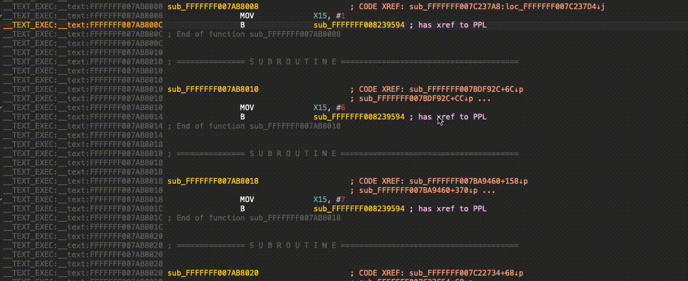

# PPLorer
PPLorer is an IDA plugin that resolves PPL calls to the actual underlying PPL function.
## Installation
1. install [ida-netnode](https://github.com/williballenthin/ida-netnode) somewhere IDA can import it
2. clone the repository and symlink `~/.idapro/plugins/pplorer.py` to `pplorer.py` in the cloned repo
## Usage

### Preliminary Analysis
1. open an IDB and make sure autoanalysis has finished  
2. from the menu select `Edit -> Plugins -> PPLorer -> Analyse IDB`  
3. done!

### Continuous Use
**TL;DR**
`CTRL-SHIFT-X` or `Right Click -> Jump to PAC XREFs` at suitable locations will open a selection window

**From call site to PPL function**
1. place the cursor on a branch instruction instruction to the PPL gate (marked with a comment- "has xref to PPL").
2. press the hotkey or activate the menu entry
3. the matching PPL function will pop.

**From PPL function to call sites**
1. place the cursors either the start address of a PPL function
2. press the hotkey or activate the menu entry
3. a list of possible call sites will open

## Principals of Operation
PPL has a gate that all the calls from the kernel get to. Before that gate each separate call puts in a pre-determined register (X15) the selector of the PPL function it wants to call.
The control will be transferred to the PPL dispatch which will check that a valid function was selected and will then go to the PPL functions table and call it.
We find the dispatch, extract the size of the PPL functions table and its address.
Then we detect all the calls to the gate from the kernel side, and get the PPL selector that is put in X15.
For each call we match a function from the PPL table and for each function on the PPL table we add all the matching kernel calls.

## Meta
Authored by Omer Porzecanski of Cellebrite Labs. \
Based on pacXplorer by Ouri Lipner while at Cellebrite Labs. \
Developed and tested for IDA 8 on OS X, iOS 15.X+ for A12+

## I want to work with you ##
[click here](https://cellebrite.com/en/about/careers/positions/co/israel/0B.613/ios-security-researcher/all) (Remote talent welcome)